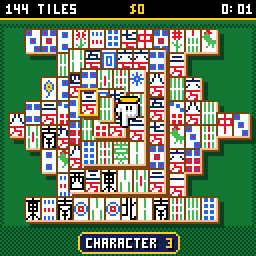
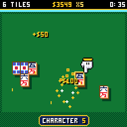
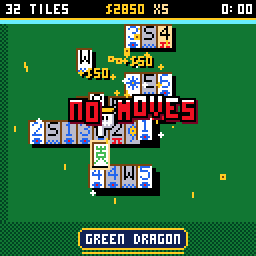
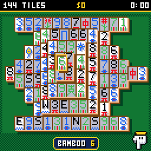
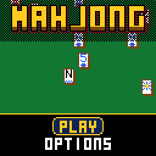
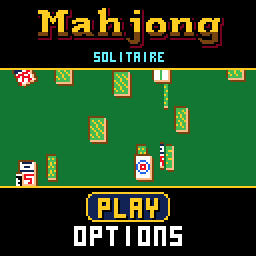
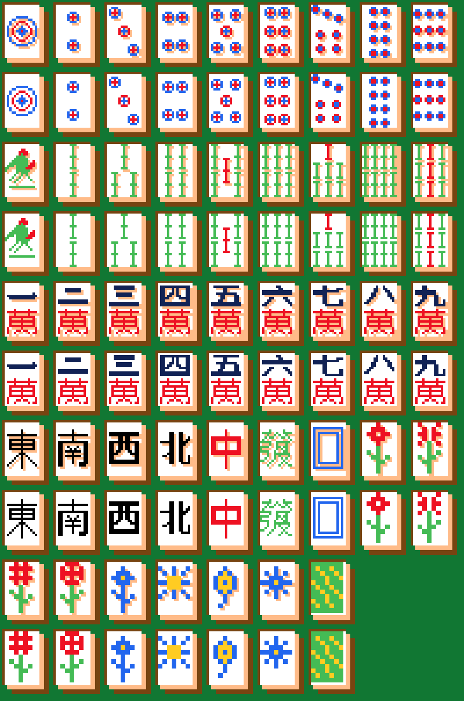

# CHMahjong

Mahjong solitaire for the [CHGame](https://github.com/bateske/CH32SerialBoot)
handheld (CH32X035 RISC-V, 128x128 colour LCD, piezo), in the casino style
of [CHBlackjack](https://github.com/bateske/CHBlackjack) and
[CHChess](https://github.com/bateske/CHChess): 144 traditional tiles -
dots, bamboo, characters, winds and dragons - stacked on the felt, a close-up camera that whips in round the glove, a
pointing glove that hops between the tiles you can take, pairs that
fly together and burst into sparks and coins, chips for every pair and a
streak that pays more the faster you find the next one, and JACKPOT! in
Blackjack's dancing rainbow letters when the table is cleared.

Every deal can be cleared, and there are four layouts: the classic TURTLE,
ARENA, BRIDGE and TWINS.

| Taking pairs | The jackpot | No moves: a shuffle |
|---|---|---|
|  |  |  |
| **The close-up (hold B)** | **The deal** | **Title** |
|  |  |  |

The faces, as drawn for the close-up:

(Captured from the PC simulator in `tools/chsim`, which runs the real game
and graphics code and renders what the device shows:
`python tools/chsim/chdrive.py --sim . tools/scripts/showcase.txt docs/`.)

The 3x5 lettering is Press Play On Tape's font, as in CHBlackjack. See
`NOTICE`.

## Installing

You need the Arduino IDE (2.x) or `arduino-cli`, and:

1. **The CHGame board package, 0.2.4 or later** (Boards Manager URL
   `https://github.com/bateske/CH32SerialBoot/releases/latest/download/package_chgame_index.json`).
2. **The CHGfx library, 1.3.0** from <https://github.com/bateske/CHgfx>.
3. **This repository**, in a folder named `CHMahjong`.

Pick *Tools > Optimize > Smallest + LTO* and *Tools > USB > Upload only*
(the game has no use for USB Serial; uploading works as before). From the
command line:

    arduino-cli compile -b CHGame:ch32v:CHGame:opt=oslto,rtlib=nano,periph=game,usb=uploadonly CHMahjong
    arduino-cli upload  -b CHGame:ch32v:CHGame -p COMx CHMahjong

(`python tools/device.py build` does the same.) Built that way the game is
40 KB of the 50.9 KB application region.

## Playing

Take the tiles off the table two at a time. A pair is two tiles with the
same face (any flower goes with any flower, any season with any season),
both **free**: nothing lying on any part of them, and nothing touching
their left side, or nothing their right. The glove only ever stops on free
tiles, so it shows you which ones you can take.

| Button | On the table | Elsewhere |
|---|---|---|
| D-pad | move the glove to another free tile | menus |
| A | pick the tile up; on a matching tile, take the pair; on another tile, pick that one up instead; on the same tile, put it down | select |
| B | put the tile down; with none in hand, undo the last pair | back |
| B held | the close-up: the camera whips in to twice the size round the glove until you let go; the D-pad and A still play | |
| SELECT | hint: a pair you can take blinks (costs $25) | |
| START | pause: resume, shuffle, new deal, save + quit | |

The glove only stops on free tiles. UP and DOWN take it to the nearest one
that way; LEFT and RIGHT step through them as you would read them, along
the row and on to the next, so either of those alone visits every tile.
The tile under it is raised, with a shimmering outline, and a plate at the
foot of the screen names it ("BAMBOO 5", "RED DRAGON"). Pick one up and it
floats with a rainbow outline, its free twins blink, and the plate says
PAIR! when the glove is on one. Leave the glove alone for a moment and it
draws back to the corner of the table, off the pile, so it hides nothing
while you look.

**Chips.** A pair pays $10. Take another within five seconds (the bar under
the top line shows how long is left) and it pays double, then triple, up to
five times: the streak. Flowers and seasons pay double again. Clearing the
table pays $500 and $1 for every second under fifteen minutes. An undo
gives the pair's chips back; a hint costs $25 and a shuffle $100.

**No moves?** When no pair is left the game says so and offers a SHUFFLE
(the tiles left are dealt again, face down, so that they can be cleared:
four a game), UNDO, or a NEW DEAL.

Your best chips and time on each layout are on the layout screen (hold
SELECT there to clear them). Options: sound, table colour (green, blue,
red, purple felt), tiles (CLASSIC, the traditional faces, or EASY:
numbers, and a mark for the suit), view (FULL,
or CLOSE: play in the close-up, and B held shows the whole table) and the
pace (FUN, or QUICK: no deal animation, shorter flights). Options, bests and a
game in progress (SAVE + QUIT, then CONTINUE) are saved to flash and
survive re-uploading. CHBlackjack and CHChess keep their saves in the same
two flash pages, so saving in one game replaces another's.

## How it fits

* **The pile** sits on a grid of half tiles, so tiles can straddle the ones
  below (the turtle's top tile, its side tiles). A layout is a list of rows
  of tiles (about 100 bytes each, from the text maps in `tools/layouts/`),
  sorted at load into drawing order: a layer at a time and along the
  diagonals within it, so each tile's side falls only on tiles drawn before
  it. Whether a tile is free is a few shifts on one word per row.
* **Every deal can be cleared** because it is made by playing a full table
  backwards: take two free tiles at random, give them a pair of faces, set
  them aside, until none are left; if the last tiles end up on top of one
  another, start again (about one deal in fifteen on the turtle). It is
  worked out a few pairs a frame under the shuffle rattle, and comes out
  the same however the work is split, so a saved game is just the deal's
  seed and the pairs taken, replayed.
* **Tiles** are drawn from faces at 2 bits a pixel: the face, its
  emboss (the art's shade, a pixel down and right, which `tools/assets.py`
  works out from the art) and two inks, through colours chosen at draw
  time - so one set of art is a tile, a white flash or a gold shimmer. The
  classic set has two sizes: 8x12 (24 bytes a face) for the whole table,
  left flat because at 7 px an emboss muddies the strokes, and 16x24 (96
  bytes) for the close-up, drawn pixel for pixel rather than doubled, with
  the dots and bamboo in their traditional patterns. Each stands on a body drawn as two bands, ivory then wood, like
  a real tile's thickness and backing, and the bottom layer casts a shadow
  on the felt. A tile lying squarely on another hides all of it but its
  body, so only that is drawn.
* **The close-up** draws the pile through a camera: tiles at 1x and 2x
  are byte-wide copies from SRAM (at 2x a source pixel is a byte, a row two
  rows), and the whip's in-between sizes are drawn a pixel at a time. When
  nothing moves the pile is not redrawn at all: the outlines are palette
  colours that animate for free.
* **Sound** is a piezo sequencer of short step lists: a clack for each tile
  dealt, two clacks and a chime that climbs with the streak for a pair, a
  rattle for the shuffle, and CHBlackjack's fanfare for the jackpot.

## Development

The tools need Python 3 with `pip install -r tools/requirements.txt`, and a
C++ compiler (zig, clang++ or g++ on the PATH, `pip install ziglang`, or
`CHSIM_CXX="path/to/zig c++"`).

* `python tools/tests/run_tests.py` - the layouts, the free rule against a
  slow reference, 10,000 deals of each layout cleared by their own order,
  the same deal however it is stepped (and against known hashes: a changed
  deal would break saved games), matching, the streak, undo, shuffles
  (including tiles that cannot be dealt), saved games, the cursor reaching
  every free tile, and random calls in any order.
* `python tools/chsim/chdrive.py --sim . tools/scripts/clear.txt out/clear` -
  runs the game from a script and writes screenshots, a contact sheet and
  GIFs. `solve N` takes the deal's own next N pairs with the D-pad and A
  as a player would; `auto N` takes any N pairs; `goto TILE` walks the
  glove; `say G <layout> <seed>` deals a table, `say M <a> <b>` takes a
  pair; `rec` records a GIF across a script; `cal` and `perf` estimate the
  device's render time. Scripts: `ui.txt` (every screen), `match.txt` (a
  pair, frame by frame), `clear.txt` (a whole table to the jackpot),
  `stuck.txt` (no moves, undo, shuffle, hint), `save.txt` (save, continue),
  `zoom.txt` (the close-up, and a pair taken in it), `perf.txt` (render
  cost at both sizes).
* `python tools/device.py upload [--debug]` - build and upload (`--debug`
  adds the serial protocol for screenshots, injected input and lockstep);
  `python tools/device.py run tools/scripts/device_render.txt out/device`
  measures what a frame costs to draw on the board.
* **The classic faces:** `python tools/faces.py` writes
  `tools/art/classic.txt` (7 x 11) and `classic2x.txt` (15 x 23): the dots
  and bamboo laid out from their patterns, the characters, winds, dragons
  and the bird as text in the script. Edit either file afterwards (or the
  script), then `python tools/assets.py`.
* **The EASY faces:** `python tools/sheet.py export` writes
  `tools/art/sheet.png`, an indexed PNG of every face on the game's
  palette; edit it, then `python tools/sheet.py import` turns it back into
  `tools/art/tiles.txt` and rebuilds the assets. (The text file can be
  edited directly too: a letter is a colour.) A face may use two colours
  besides the tile's white.
* **Layouts:** edit or add a map in `tools/layouts/` (an X for each tile's
  corner, a grid per layer), then `python tools/layouts.py` checks it (it
  fits the screen, nothing hangs in the air, a deal can be found) and
  writes `src/game/Layouts.cpp`. Saved games replay their deal: bump
  `VERSION` in `src/save/Save.cpp` when a layout or the deal changes.
* `python tools/assets.py` packs the art, `python tools/audio/preview.py
  out/` renders the sound effects to WAV.

## License

Apache License 2.0 (`LICENSE`). See `NOTICE`.
